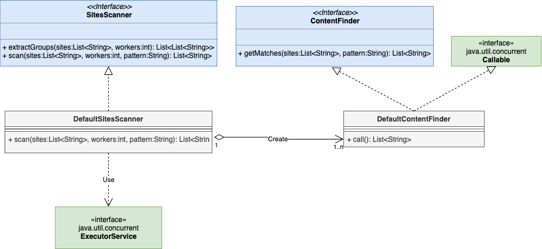

# Sites Scanner

This Java application gets a list of URLs an concurrently finds matches of a pattern in the main page of every website.

The 2 main classes in the model are *SitesScanner* and *ContentFinder*:



Concurrency is managed using the concurrency library in Java, with the *ExecutorService*.

The number of workers in parallel is an argument of the application, but it calculates the final number of groups of sites to process, putting the remaining in an extra group.

## Running the app

The app gets 3 arguments:

1. **File path:** Path to the sites.txt file with the list of sites to scan.
2. **Number of Workers:** Number of workers to work in parallel to scan the full list of sites.
3. **Pattern:** Text to find. 

Therefore, to invoke the application you should run the following command:

```
# Go the root folder
cd sites-scanner

# Build the app
gradle build

# Run the app
gradle run --args {sites_file_path} {number_of_workers} {pattern}

# Examples
# There is a file sites.txt in the root folder for testing purposes, 
# but you can set an absolute path to an external txt file.

gradle run --args="sites.txt 3 Coronavirus"
gradle run --args="/Users/advargas/Documentos/sites2.txt 3 Coronavirus"
```


## Concurrency

In the current implementation, *DefaultSitesScanner* and *DefaultContentFinder* are using the classes in *java.util.concurrent* and the *ExecutorService* to start a thread pool and scan the sites in parallel according to the number of workers. New implementations of *SitesScanner* and *ContentFinder* could be added to provide different approaches of concurrency management.

With *ExecutorService* a thread pool is initiated according to the number of workers, and all the tasks are executed in an asynchronous mode:

```java
Executors.newFixedThreadPool(workers);
```

The response of all tasks is recovered through *Future*:

```java
List<Future<List<String>>> futures = executorService.invokeAll(callableTasks);
```
## Number of Workers

The number of workers is an argument in the Java app. However, the application splits the list of sites according to the number of workers and leave the remaining sites in an extra group.

For this partition of groups, the app implements the *Partition* class suggested here:

[https://e.printstacktrace.blog/divide-a-list-to-lists-of-n-size-in-Java-8/](https://e.printstacktrace.blog/divide-a-list-to-lists-of-n-size-in-Java-8/)

*Google Guava* and *Apache Commons Collections* are alternative options to implement this division in groups.


## Content Finder

To find the pattern in the main page of every website, the class *WebUtils* downloads the html code and using the library **jsoup** extracts the page content removing the html portion.

[https://jsoup.org/](https://jsoup.org/)
